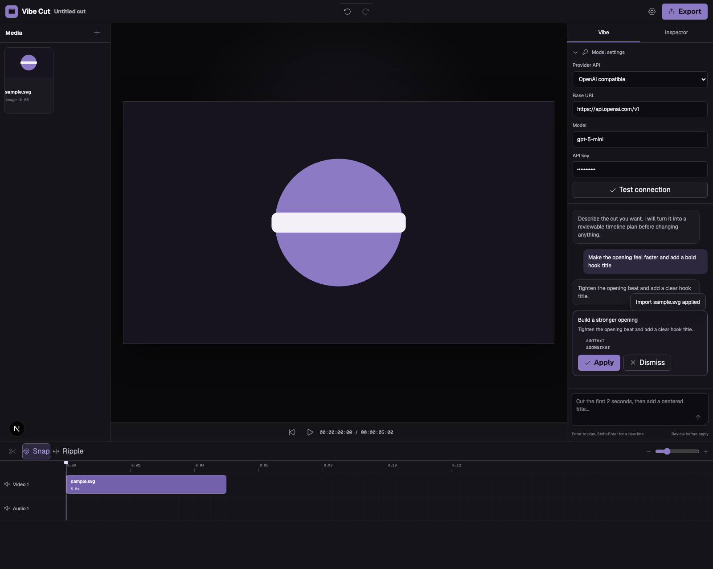

# Vibe Cut

Vibe Cut is a browser-first, non-destructive video editor where manual editing
and conversational AI operate on the same versioned timeline.



## What works

- Local video, audio, and image import with metadata probing and IndexedDB
  persistence.
- Multi-track timeline with playhead, zoom, snapping, clip selection, moving,
  ripple trimming, splitting, and 100-step undo/redo history.
- Canvas preview with transforms, fit modes, opacity, picture adjustments, text
  layers, direct pointer dragging, keyboard nudging, playback, and standard
  aspect-ratio presets.
- Synchronized video and audio preview with track visibility and mute semantics.
- Local MP4 (H.264/AAC) or WebM (VP9/Opus) export through WebCodecs and
  Mediabunny, selected by browser capability.
- Vibe editing with configurable OpenAI-compatible or Anthropic models.
- Forced structured tool calls that produce a reviewable, validated,
  revision-bound edit plan before any timeline mutation.
- Atomic application: one invalid operation rejects the entire plan.
- Cross-reference and source-window validation prevents missing tracks/assets,
  incompatible media tracks, or edits that run past source duration.
- Browser-local API keys. Keys are sent only for the selected provider request
  and are not written to server storage or logs.

## Quick start

Requirements: Node.js 22+ and a current Chromium or Safari browser.

```bash
npm install
npm run dev
```

Open `http://localhost:3000`, import media, then expand **Model settings** in the
Vibe panel to choose a provider, base URL, model, and API key.

Custom OpenAI-compatible origins must be explicitly enabled:

```bash
VIBECUT_AI_ALLOWED_ORIGINS=https://llm.example.com npm run dev
```

Copy `.env.example` to `.env.local` for persistent deployment configuration.
Never commit provider keys.

To mount the app below an existing domain, build and run it with a base path:

```bash
NEXT_PUBLIC_BASE_PATH=/vibe-cut npm run build
NEXT_PUBLIC_BASE_PATH=/vibe-cut npm start
```

## Quality gates

```bash
npm run lint
npm run typecheck
npm test
npm run test:e2e
npm run build
```

The browser suite covers desktop Chromium and mobile WebKit. It imports real
local media, changes canvas settings, generates and applies a mocked structured
AI plan, and performs an actual encoded video download in Chromium.

## Architecture

The central contracts live in:

- `src/core/schema/project.ts` — serializable project, track, asset, clip,
  transition, and marker schema.
- `src/core/schema/edit-plan.ts` — the only operations an AI or UI command may
  apply.
- `src/core/editor/apply-edit-plan.ts` — pure revision check, clone, operation
  execution, full validation, and atomic commit.
- `src/core/render` and `src/core/export` — deterministic preview/export path.
- `src/app/api/ai` — provider adapters, schema-constrained planning, timeouts,
  payload limits, rate limiting, and SSRF origin allowlisting.

More detail is available in [architecture](docs/architecture.md),
[AI edit contract](docs/ai-edit-schema.md), and
[reference research](docs/research.md).

## Reference research

Vibe Cut is a new MIT implementation informed by:

- OpenCut for its browser-first editor model, normalized project document,
  command history, and Mediabunny/WebCodecs export direction.
- Clypra for source-time math, timeline revision discipline, snapping/ripple
  intent, and immutable render snapshots.
- The deployed aiHubHub pi-web model-settings flow for the distinction between
  provider, base URL, model, API key, and connection testing.

No reference source code or pi-web agent/session runtime is reused.

## Current scope

The shipped foundation supports deterministic timeline editing and structured
AI changes. Transcript editing, automatic captions, semantic scene detection,
background jobs, shared cloud projects, and proxy media are logical next
milestones rather than implied behavior in this release.

## License

MIT
